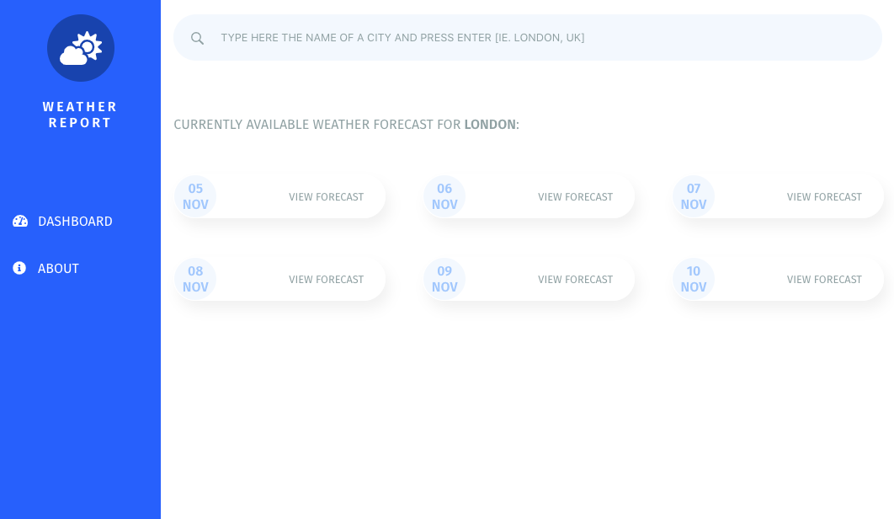

# Weather Forecast

This is an app that provides weather forecasts for your favourite location by consuming the **Open Weather Map** API. 



## Getting started

If you want to play around with this project, just clone it to your local machine and install the dependecies with the command `$ yarn`.

### Using Redux DevTools

You can track what's happening in the Redux Store by connecting the app to the Redux DevTools. To use the feature, install the DevTools extension ([click here for the Chrome Web Store](https://chrome.google.com/webstore/detail/redux-devtools/lmhkpmbekcpmknklioeibfkpmmfibljd?hl=en-GB)) and uncomment the following lines in `src/index.js`:

```javascript
const reduxDevTools =
  window.__REDUX_DEVTOOLS_EXTENSION__ && window.__REDUX_DEVTOOLS_EXTENSION__();
```

Then edit the `createStore()` function as follows:

```javascript
const store = createStore(
  reducer,
  compose(applyMiddleware(sagaMiddleware), reduxDevTools)
);
```

## Notes on the API
Please note that in order to use the Open Weather Map API you need to provide a valid key. To get it you can register for free [following this link](https://home.openweathermap.org/users/sign_up).

Once you got your personal key, save it as follows in a file named `apikey.js` in `src/redux/sagas/`:

```javascript
export const API_KEY = 'YOUR_API_KEY_HERE';
```

### Don't want to register to the API?
You can still test and extend this app by using some dummy data. This is also particularly useful if you're developing new components and don't want to exceed the API request limit, even though you won't get real time weather forecast nor have the chance to play around with the input field to change location.

To load the dummy data to the store you need to open the file at `/src/redux/reducers/forecast.js`. Then, uncomment the import line:

```javascript
import { dummyData } from './dummyData.js';
```

and update the initial value for the `state` variable as follows:

```javascript
const forecast = (
  state = dummyData,
  action
) => ...
```

## Get involved!
I'm aware that some parts of the app may appear overcomplicated: this is something built for fun and to learn, it was an intentional choice to make the exercise more relevant to me. If you can't stand that and absolutely want to provide a cleaner, more reliable and more perfomant solution, you're very welcome to open a pull request so that we can learn from each other :stuck_out_tongue_winking_eye:. 